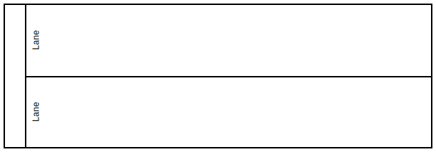
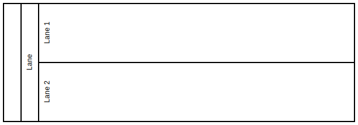
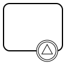
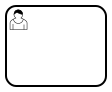
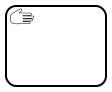
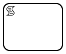
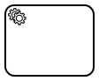
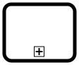

# Unterstütze BPMN-Elemente

## Participants/Lanes

### Pool


Ein Pool definiert den auszuführenden Prozess.
Ein Pool kann mehrere Lanes enthalten.

### Lanes



Lanes dienen zur Organisation und Veranschaulichung verschiedener Verantwortungsbereiche.
Eine Lane kann beliebig viele FlowNodes enthalten, aber eine FlowNode kann immer nur zu einer Lane gehören.

Der Name der Lane entscheidet dabei, ob ein User die darin enthaltenden FlowNodes sehen, bzw ausführen kann.

### Lanesets



Eine Laneset beschreibt eine Sammlung von Lanes.
Jeder Pool hat per default ein Laneset.
Jede Lane kann ebenfalls ein Laneset beinhalten. In diesem Fall spricht man von Sublanesets.


## Events

### StartEvents


Stellt den Beginn eines Prozesses dar.
Kann optional mit einem initialen Token gestartet werden.

#### MessageStartEvent


Der Prozess wird automatisch gestartet, wenn eine passende Message eintrifft.

#### SignalStartEvent


Der Prozess wird automatisch gestartet, wenn ein passendes Signal empfangen wird.

#### TimeStartEvent


Der Prozess wird automatisch gestartet, wenn der angehangene Cronjob getriggert wird.

### IntermediateEvents


Ein untypisiertes Event, das einfach ausgeführt wird, ohne eine Aktion zu tätigen.

#### IntermediateLinkCatchEvent


Führt den Prozess an dieser Stelle weiter, wenn ein passendes `IntermediateLinkThrowEvent` erreicht wurde.

Wichtig:
Es darf pro Prozessmodell immer nur **ein** `IntermediateLinkCatchEvent` pro Link geben!

#### IntermediateLinkThrowEvent


Der Prozessfluss wird über den definierten Link zu einem `IntermediateLinkCatchEvent` weitergeleitet, welches die gleiche Linkdefinition enthält.

#### IntermediateTimerEvent


Startet einen Timer, der die Prozessausführung für eine bestimmte Zeit pausiert.
Es kann eine konkrete Dauer angegeben werden, oder ein bestimmtes Datum, an dem die Prozessausführung fortgesetzt werden soll.

#### SignalIntermediateCatchEvent


Pausiert die Prozessausführung, bis ein vordefiniertes Signal empfangen wurde.

#### SignalIntermediateThrowEvent


Schickt ein vordefiniertes Signal aus und führt den Prozess ohne Unterbrechung weiter.

Anders als beim SendTask, wird hier nicht auf eine Empfangsbestätigung gewartet ("Fire and forget").

#### MessageIntermediateCatchEvent


Pausiert die Prozessausführung, bis eine vordefinierte Message empfangen wurde.

#### MessageIntermediateThrowEvent


Schickt eine vordefinierte Message aus und führt den Prozess ohne Unterbrechung weiter.

Anders als beim SendTask, wird hier nicht auf eine Empfangsbestätigung gewartet ("Fire and forget").

### BoundaryEvents

#### ErrorBoundaryEvent


Dient dazu Fehler an einer Activity abzufangen.

Tritt in der Activity ein Fehler auf, welcher einen passenden Code und/oder einen passenden Namen hat,
so wird die Prozessausführung über dieses BoundaryEvent geleitet.

Werden Name, Code und Message leer gelassen, wird das BoundaryEvent **alle** Fehler abfangen.

#### SignalBoundaryEvent



Führt den angehangenen Prozesspfad aus, sobald ein passendes Signal empfangen wird.

Die Ausführung der Activity, an welcher das BoundaryEvent hängt, wird forciert beendet.
Der Pfad, der von der Activity aus geht, wird dann **nicht** weiter fortgesetzt.

#### MessageBoundaryEvent


Führt den angehangenen Prozesspfad aus, sobald eine passende Message empfangen wird.

Die Ausführung der Activity, an welcher das BoundaryEvent hängt, wird forciert beendet.
Der Pfad, der von der Activity aus geht, wird dann **nicht** weiter fortgesetzt.

#### TimerBoundaryEvent


Führt den angehangenen Prozesspfad aus, sobald der modellierte Timer getriggert wird.

Die Ausführung der Activity, an welcher das BoundaryEvent hängt, wird forciert beendet.
Der Pfad, der von der Activity aus geht, wird dann **nicht** weiter fortgesetzt.

#### NonInterruptingSignalBoundaryEvent


Führt den angehangenen Prozesspfad aus, sobald ein passendes Signal empfangen wird.

Die Activity, an welcher das BoundaryEvent hängt, wird nicht unterbrochen und läuft regulär weiter.

#### NonInterruptingMessageBoundaryEvent


Führt den angehangenen Prozesspfad aus, sobald eine passende Message empfangen wird.

Die Activity, an welcher das BoundaryEvent hängt, wird nicht unterbrochen und läuft regulär weiter.

#### NonInterruptingTimerBoundaryEvent


Führt den angehangenen Prozesspfad aus, sobald der modellierte Timer getriggert wird.

Die Activity, an welcher das BoundaryEvent hängt, wird nicht unterbrochen und läuft regulär weiter.

### EndEvents


Der Prozess wird bei erreichen des Events beendet.

#### ErrorEndEvent


Der Prozess wird mit dem modellierten Fehler beendet.

Ebenfalls wird die zugehörige Prozessinstanz in der Datenbank als fehlerhaft markiert.

#### SignalEndEvent


Sendet beim beenden des Prozesses ein Signal.

#### MessageEndEvent


Sendet beim beenden des Prozesses eine Message.

#### TerminateEndEvent


Für die Ausführung mit ParallelGateways:

Wie ErrorEndEvent, forciert jedoch das sofortige Beenden aller parallel laufenden Pfade.


## Activities

### UserTask



Stellt eine Aufgabe dar, die von Benutzern abgearbeitet werden kann. Der Benutzer kann Eingaben machen.

Wie ein UserTask konfiguriert werden kann, wird in der [DynamicUi](https://github.com/process-engine/dynamic_ui_core/blob/develop/README.md) erklärt.

### ManualTask



Stellt eine Aufgabe dar, die der Benutzer manuell erledigen muss.
Der Task besitzt keine Eingaben und erzeugt kein Ergebnis.

### Empty-Activity


Pausiert die Prozessausführung, bis der Benutzer sie manuell fortsetzt.
Im Gegensatz zu ManualTask und UserTask, stellt dies keine Aktiviität dar, sondern ist eine einfache, untypisierte Pausierung des Prozesses.

### SendTask


Verschickt eine vordefinierte Message.
Die Ausführung wird pausiert, bis der SendTask eine Empfangsbestätigung von einem ReceiveTask erhalten hat.

### ReceiveTask


Wartet auf das Eintreffen eine Message, die durch einen SendTask verschickt wurde.

### ScriptTask



Führt JavaScript Code Snippets aus.

### ServiceTask



Erlaubt die automatische Ausführung von bereit gestellten Services der ProcessEngine.
Unterstützt aktuell ExternalTasks und Http Tasks.

### CallActivity



Führt ein anderes, externes Prozessmodell als Subprozess aus. Das referenzierte Prozessmodell muss auf derselben ProcessEngine deployed sein.
Der Task wird so lange pausiert, bis der referenzierte Prozess abgeschlossen wurde.

Wird der referenzierte Prozess mit einem Fehler beendet, so wird die Activity ebenfalls mit einem Fehler beendet.

### SubProcess


Ein Subprozess, der, anders als eine CallActivity, direkt in das Prozessmodell eingebettet wird.
Tritt in dem Subprozess ein Fehler auf, so wird auch die Activity mit einem Fehler beendet.

## Artifacts

### TextAnnotation


Die TextAnnotation kann benutzt werden um z.B. Kommentare an eine FlowNode zu knüpfen.
Für die Heatmap kann man hier ebenfalls eine erwartete Laufzeit anhängen.

Beispiel:

````text
RT: 00:01:45
````

## Gateways

### Exclusive Gateway


Der Prozess wird zu einem der modellierten, ausgehenden Pfade umgeleitet.
Welcher Pfad genommen wird, hängt davon ab, welcher SequenceFlow eine passende Bedingung enthält.
Ein ExclusiveGateway kann beliebig viele ausgehende Pfade besitzen, jedoch kann immer nur **ein** Pfad pro Prozessinstanz ausgeführt werden.

Es ist möglich einen default SequenceFlow zu definieren, der benutzt wird, falls keiner der SequenceFlows eine zutreffende Bedingung enthält.

### Parallel Gateway


Führt alle modellierten Pfade parallel aus.
Anders als beim ExclusiveGateway, sind die Ausführungen dieser Pfade nicht an Bedingungen geknüpft.
