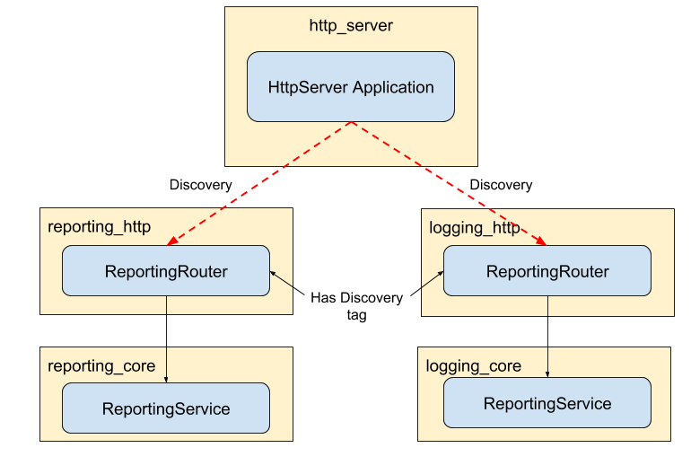

Addict IoC is a lightweight IoC container with a fluent declaration syntax,
easing your development and simplifying your code.

It is designed to be easily extensible for your own needs, without complicating
the architecture by abstractions.

[](https://jenkins.mindassist.net/job/Addict.IoC)

# Features

```
* Fluent declaration syntax
* Fully covered by unit tests
* Written in TypeScript, transpiled into ES2017
  * Lightweight
  * Well structured, easily understandable code
  * Typings included
* Dependency Injection into
  * Constructor
  * Properties
  * Methods
* Discovery by tags and key/value matching
* Singleton or transient instantiation
* Injection with lazy instantiation
* Support for factory functions
* Circular dependency detection
* Configuration injection
* Optional auto-bind methods (e.g.: EventHandler) to instance
* Validation of registered dependencies
* Supports service locator pattern
```

# Table of Contents

1. [Basic Usage](#basic-usage)
    1. [Import Package](#import-package)
    1. [Customizing Default settings](#customizing-default-settings)
    1. [Dependency Injection](#dependency-injection)
1. [Advanced Usage](#advanced-usage)
    1. [IoC Module Pattern](#ioc-module-pattern)
    1. [Registration](#registration)
        * [Register a class](#register-a-class)
        * [Register a factory function](#Register-a-factory-function)
        * [Register a static object](#register-a-static-object)
    1. [Resolving a Registration](#resolving-a-registration)
        * [Resolve instance with injection arguments](#resolve-instance-with-injection-arguments)
        * [Resolve factory with injection arguments](#resolve-factory-with-injection-arguments)
    1. [Lazy Injection](#lazy-injection)
    1. [Configuration](#configuration)
        * [Static configuration](#static-configuration)
        * [With Function Reference (defered)](#with-function-reference-(defered))
    1. [Validation](#validation)
    1. [Discovery](#discovery)
        * [Simple string tags](#simple-string-tags)
        * [Tags with Key-Value pairs](#tags-with-key-value-pairs)
    1. [Multiplicity](#multiplicity)
        * [Transient](#transient)
        * [Singleton](#singleton)
    1. [Overwrite Dependencies](#overwrite-dependencies)
    1. [Bind Functions to Instance](#bind-functions-to-instance)
    1. [Targeted Injection](#targeted-injection)
        * [Inject into property](#inject-into-property)
        * [Inject into function](#inject-into-function)
1. [Supported by](#supported-by)


# Basic Usage

## Import Package

The package exports the container class under the key `Container`.
Ideally, you want to instantiate the container only once and use that instance
throughout your application.

Using plain NodeJS (up to ES5), you can create a container like this:

```js
const Container = require('addict-ioc').Container;

const container = new Container();
```

When using ES6, you can use the new `import` structure:

```js
import {Container} from 'addict-ioc';

const container = new Container();
```

And using TypeScript, it will look like this:

```TypeScript
import {Container} from 'addict-ioc';

const container: Container = new Container();
```

That's it.
Now you are ready to fill your new container with life.

For the sake of simplicity, we will stick with the old-school ES5 notation
throughout this Readme.

## Customizing Default settings

The container comes with a wide range of settings, all of which will get a well
thought-out set of defaults.
These settings are automatically applied to any registration added to the container.

Should you wish to pass your own settings to the container, you can do so by
passing your own set of configurations into the constructor.

Here is an example:

```js
const Container = require('addict-ioc').Container;

const myOverwrittenSettings = {
  isSingleton: false,
  isFactory: false,
  conventionCalls = ['initialize'],
}

const container = new Container(myOverwrittenSettings);
```

Here is a list of all possible settings and their default values:

```js
const defaultSettings = {
  defaults: {
    isSingleton: false,
    isTrueSingleton: false,
    wantsInjection: true,
    dependencies: [],
    lazyDependencies: [],
    lazyDependenciesAsync: [],
    ownedDependencies: [],
    functionsToBind: [],
    overwrittenKeys: {},
    overwrittenConventionCalls: {},
    injectConventionCalled: {},
  },
  // This is the default resolver, provided by the addict-ioc package.
  // The resolver will perform the task of creating instances from your
  // registered types.
  resolver: new Resolver(),
  // The key under which the container itself is registered.
  // This will allow you to inject the container into a resolved instance.
  containerRegistrationKey: 'container',
  // Circular dependencies are usually safe, when using singletons.
  // But if you still want the container to throw an error, when detecting a
  // circular dependency with singletons, you can set this to "false".
  circularDependencyCanIncludeSingleton: true,
  // Same as above, only for lazy dependencies.
  circularDependencyCanIncludeLazy: true,
  conventionCallTypes: [ConventionCallType.Class],
};
```

## Dependency Injection

Basic dependency injection is easily achieved.
You just need to register one or more types at the container,
using the `container.register('key', type)` function.

Afterwards, these types can be declared as dependencies at any
registration.

By default, each dependency is injected into the resolved instance's constructor.

Example:

```js

// Some test class.
class SomeEmailService {}

// Another test class.
class SomeUserService {}

// A test class that has both of the above classes as a dependency.
class MyUserNotifier {

  constructor(emailService, userService) {
    this._emailService = emailService;
    this._userService = userService;
  }
}

// Register the test classes:
// Note that the key does not have to match the name of the type you are
// registering here.
// You can use whatever key you like.
container.register('EmailService', SomeEmailService);
container.register('UserService', SomeUserService);

// Now register the test class that uses the others as dependencies.
// Keep in mind that the dependencies will be injected in the same order as stated
// here.
container
  .register('UserNotifier', MyUserNotifier)
  .dependencies('UserRepo', 'EmailService');

const myUserNotifierInstance = container.resolve('UserNotifier');
```

Calling `container.resolve('UserNotifier')`, will get you an instance of
'MyUserNotififer', which in turn will get an instance of 'SomeUserRepository'
and 'SomeEmailService' injected into its constructor.

That's it.

# Advanced Usage

## IoC Module Pattern

Since the IoC container is used to decouple your applications components,
it is not a good idea to directly use the container in all of your classes.

Consider the following example as an `ANTI`-pattern:

```js
const container = require('addict-ioc');

class MyUserRepository {
  // ...
}

container.register('UserRepo', MyUserRepository);

module.exports = MyUserRepository;
```

When you have, say, five dozen classes you wish to register in the
container, this pattern will become very hard to maintain, since all
registrations are floating around in five dozen different places.

Let's consider a more modular approach, where your application consists of
several self-contained modules.
Each of the modules should know how the dependencies of its inner classes
interact and which external dependencies it has.

Now, if we take a closer look at those external dependencies, the self-contained
module needs a way to reference its external dependencies, so that the external
dependency itself can load its dependencies the same way
(yep we're building a dependency tree here).

The easiest way to achieve this is to let each self-contained module expose a
function that takes the container instance as a parameter and registers all
dependencies on that instance.


```js
// modules/user/ioc_module.js

function registerInContainer(container) {

  const ItemIocModule = require('item/ioc_module');

  // Contains a registration for 'ItemService' and other
  // related registations.
  ItemIocModule.registerInContainer(container);


  container
    .register('UserRepo')
    .singleton();

  container
    .register('UserService')
    .dependencies('UserRepo', 'ItemService')
    .singleton();

}

module.exports.registerInContainer = registerInContainer;
```

The following folder structure shows how functional modules can consist of
several layers, in this case `service` and `repository` layers.

Every module defines its dependencies via an `ioc_module.js` and can reference
other modules' ioc modules as well, just like in the example above.

```
modules/
  user/
    modules/
      user_service/
        lib/
          user_service.js
      user_repository/
        lib/
          user_repository.js
    index.js
    ioc_module.js
    package.json
  item/
    modules/
      ...
    index.js
    ioc_module.js
    package.json
index.js
ioc_module.js
package.json
```

## Registration

The container provides multiple functions for creating registrations.
Each of these functions returns the created registration, which allows the use
of a fluent syntax for declaring and enhancing registrations.

For example:

```js

container
  .register('someKey' sometype)
  .dependencies('someService')
  .injectInto('someTargetPropertyForTheDependency')
  .configure('some:path:to:a:config')
  .singleton();
```

This creates a registration and performs multiple configurations on it.

Don't worry if you don't understand what the chained functions do at this point.
Each of them will be explained in a later chapter.

This example only serves to demonstrate the fluent syntax that the addict-ioc
container allows.

**Important**:
Remember that each chain **must** begin with a call to `container.register()`
or one of its equivalents!
This is because each of the follow up functions is a part of the `registration`
class, an instance of which is returned by the `register` function.

Now lets take a closer look at each of the functions used for creating a registration.

### Register a class

The default method for creating a registation is `register`.
This method is used for registering classes at the ioc container, which is its
most prominent UseCase.

```js
class MyUserRepository {}

container.register('UserRepo', MyUserRepository);
```

### Register a factory function

You can register a factory function through the `registerFactory` function.

When calling `resolve`, the factory function is executed and its result is
returned to the caller.

This allows you to create instances suited to a very specific purpose.

```js
const factory = (something) => {
  return {
    logIt: () => {
      console.log(something);
    }
  }
}

container.registerFactory('factoryKey', factory);

const resolvedInstance = container.resolve('factoryKey');
```

It is also possible to pass some dependencies to the factory, which the factory
can then pass to the instances it creates.

To do this, you need to specify a target property or function into which the
dependencies are to be injected.

```js
class EmailService {}

const factory = () => {
  return {
    setEmailService: (injectedEmailService) => {
      this.emailService = injectedEmailService;
    },
  };
};

container.register('EmailService', EmailService);

container
  .registerFactory('factoryKey', factory)
  .dependencies('EmailService')
  .injectInto('setEmailService');

const resolvedInstance = container.resolve('factoryKey');
```

The factory will now return an instance of an object, which will get the
`EmailService` injected into its `setEmailService` function.

**Important** The target needs to be a property or function on the *instance*
the factory creates, **not** the factory itself!

### Register a static object

You can also register plain objects in the container.
When resolving these, they will - obviously - not be instantiated.

This can be useful, when you wish to make some information globally available,
or when you want to handle instance creation yourself.

```js
const object = {
  'this-could-be': 'virtually-anything',
}

container.registerObject('objectKey', object);
```

**Note**:
The following features are not available for object registrations:
- `dependencies`
- `injectInto`
- `singleton`
- `bindFunctions`

Using any of these with an object registration will result in an error!

## Resolving a Registration

Resolving a registration is easy:

```js
const result = container.resolve('SomeKey');
```

Or for resolving asynchronously:

```js
const result = container.resolveAsync('SomeKey');
```

This works the same for all types of registrations.

### Resolve instance with injection arguments

You can also pass customized arguments to each resolved instance,
by passing an additional parameter to the `resolve` method:

```js
class MyUserRepository {
  constructor(instanceParams) {
    this.params = instanceParams;
  }

  get params() {
    return this.params;
  }
}

container.register('UserRepo', MyUserRepository);

const instanceParams = 'hello world';

const userRepoInstance = container.resolve('UserRepo', instanceParams);

console.log(userRepoInstance.params) // This will print 'hello world'.
```

This allows for each instance to receive very specific information,
unique to each instance.

You can also pass multiple arguments to each instance.
These need to be contained in an Array:

```js
class MyUserRepository {
  constructor(param1, param2) {
    this.param1 = param1;
    this.param2 = param2;
  }

  calculate() {
    return this.param1 + this.param2;
  }
}

container.register('UserRepo', MyUserRepository);

const instanceParams = [1, 2];

const userRepoInstance = container.resolve('UserRepo', instanceParams);

console.log(userRepoInstance.calculate()) // This will print 3.
```

These arguments are not limited to any specific types and can contain whatever
you like.

### Resolve factory with injection arguments

The same mechanism can also be used for factories.

For example:

```js
const factory = (injectedArg1, injectedArg2) => {
  return {
    calculate: () => { return injectedArg1 + injectedArg2; },
  };
};

container.registerFactory('mathFactory', factory);

const sampleInjectionArgs = [1, 2];

const resolvedInstance = container.resolve('mathFactory', sampleInjectionArgs);

const calucationResult = resolvedInstance.calculate(); // The result will be 3.
```

## Lazy Injection

The `injectLazy` declaration allows the registration to determine the point in
time a class gets instantiated itself.

`lazy` dependencies will not be injected as an instance. Instead, the registered
class will get a factory function for that dependency.

The instance will only be created, when the factory function is called.

This can be very useful, if a class wants to inject some context-specific
data into the dependency in question.

```js
class SomeClass {
  constructor(args) {
    this._arguments = args;
  }

  increment() {
    return this._arguments * 2;
  }
}

container.register('SomeClassKey', SomeClass);

class SomeOtherClass {

  constructor(someClassFactory) {
    this._someClassFactory = someClassFactory;
  }

  start() {
    const instanceSpecificInfo = this.getInstanceSpecificStuff();
    this._someClass = this._someClassFactory(instanceSpecificInfo);
  }

  getInstanceSpecificStuff() {
    return 2;
  }

  printIncrementedValue() {
    console.log(this._someClass.increment()) // This will print 4.
  }
}

container
  .register('SomeOtherClassKey', SomeOtherClass)
  .dependencies('SomeClassKey')
  .injectLazy();
```

*Note*: The arguments injected into the factory function will be **appended** to
the instances registered dependencies.
No dependency gets overwritten.

## Configuration

The `configure` declaration allows you to set the `config` property of a class
instantiated by the container.

### Static configuration

This is the simplest type of configuration, in which you just pass the full set
of configs to the `.configure()` method.

```js

class SomeClass {

  set config(value) {
    this._config = value;
  }

  start() {
    console.log(this._config.configValue); // something
  }
}

container
  .register('SomeClassKey', SomeClass)
  .configure({configValue: 'something'});
```

### With Function Reference (defered)

Here, the `config` function gets executed, when the registered class it is
associated to gets instantiated.

```js
class SomeClass {

  get config() {
    return this._config;
  }

  set config(value) {
    this._config = value;
  }
}

container
  .register('SomeClassKey', SomeClass)
  .config(() => {
    console.log('config function executed');
    return { aConfigValue: 'something' }
  });

class SomeOtherClass {

  constructor(someClassLazy) {
    this._someClassLazy = someClassLazy;
  }

  start() {
    const someClass = this._someClassLazy(); // config function executed
  }
}

container.register('SomeOtherClassKey', SomeOtherClass)
  .dependencies('SomeClassKey')
  .injectLazy();
```

In case this class gets injected lazily, meaning the `config` function will not
be executed until the lazy injection is resolved.

## Validation

Before you start an application that uses the IoC container, you typically want
to be sure that you declared all the dependencies correctly, so that you won't
get any nasty errors during runtime.

For this purpose, the IoC container exposes the method `validateDependencies`.

You can call it in three different ways:
- No parameters: This will validate all registrations
- A single String: Only validate the registration with the given key
- String-Array: Validates only the given set of keys

```js
class SomeClass {}

container
  .register('SomeClassKey', SomeClass)
  .dependencies('SomeMissingRegistrationKey');

try {
  container.validateDependencies();
} catch(error) {
  // this will throw because there is a dependency missing
}
```

This method will not throw an error on the first failed validation.
Instead, it will collect all validation errors first and then throw
a validation error that contains a comprehensive report about *all*
encountered errors.

*Note*: The IoC container will see a circular dependency as valid, if there is
a `singleton` dependency in the tree.
You can adjust this by setting the value for the config parameter
`circularDependencyCanIncludeSingleton` to **false**.
This will cause the container to mark a circular dependency as invalid, even if
a singleton is present in it.

The same goes for `lazy` dependencies.
By default, a circular dependency will be seen as valid, if at least one `lazy`
dependency is present.
If you want to prevent this, set `circularDependencyCanIncludeLazy` to **false**.

## Discovery

The main goal of the IoC container is to decouple an applications components
and establish clear architectural patterns.

We should embrace that thought and use extension points in our applications.
An extension point is a component that uses the container to instantiate other
components by itself.
These are usually grouped under a specific topic or cover a specific UseCase.

An example would be a HTTP server, which uses the ioc container to instantiate
all routers that are registered within that container.

Now, if we want to decouple that server from the routers it instantiates,
we need some kind of discovery, because otherwise we would need to reference
those components directly within the server.
This would make the decoupling attempt rather pointless.

In order for the discovery to work as we intend, we need some kind of marker,
by which an extension can actually retrieve the components it needs.
Using specific naming would be one possibility, but that is highly unreliable
and easily prone to errors; simple typos can throw your application into chaos.

To get around this and offer an easy and reliable way to make the discovery work,
the ioc container offers a fluent way to attach tags to a registration.
These tags can be simple strings, or key-value pairs and will not influence the
registration itself in any way.

Consider the following (very much simplified) sample stack:



Here we have a HTTP server that has to discover and manage two routers.
The server itself knows nothing of the routers themselves and thus, is not
coupled to them.

The routers each have a tag attached to them that marks them as routers.
By use of this tag, the Http server can use the container to discover these
routers and then initialize them.

The routers themselves will have their dependencies resolve the old-fashion way,
by use of normal ioc registrations.

### Simple string tags

```js
class RedisImplementation {}

container
  .register('Redis', RedisImplementation)
  .tags('caching');

class MemcachedImplementation {}

// You can attach as many tags as you like.
container
  .register('Memcached', MemcachedImplementation)
  .tags('caching', 'secondary');
```

Both of our test classes are tagged with the same string `caching`.
These can now be discovered by calling the `getKeysByTags` method:

```js

const discoveredKeys = container.getKeysByTags('caching');

console.log(discoveredKeys);
// This will return:
// 'RedisImplementation'
// 'MemcachedImplementation'
```

This function will return all registrations, which will have the `caching` tag
attached to it, including those registrations who have additional tags attached
to them.

### Tags with Key-Value pairs

If you wish to attach a tag with a key-value pair, you can use the `setTag` method.

```js
class RedisImplementation {}

container
  .register('Redis', RedisImplementation)
  .setTag('caching', 'primaryImplementation');

class MemcachedImplementation {}

// To attach multiple key-value tags, the setTag function must be called
// repeatedly.
container
  .register('Memcached', MemcachedImplementation)
  .setTag('caching', 'secondaryImplementation')
  .setTag('someOtherTag', 'someOtherValue');
```

To discover registrations that have tags with a specific value,
you can provide a dictionary that contains the key-value pairs to look for.

```js
const attributeQuery = {
  caching: 'primaryImplementation',
};

const foundKeys = container.getKeysByTags(attributeQuery);
// This will return 'RedisImplementation'
```

## Multiplicity

The `singleton` function determines, wether a registration is a singleton,
or a transient component.

### Transient

By default, all registrations are transient, meaning that each time we `resolve`
a registration, it will be a new instance of that registration.

The same goes for `lazy` registrations or any of the registrations' dependencies.

```js
class SomeClass {}

container.register('SomeClassKey', SomeClass);
  //.singleton(false); this can be configured explicitly as well

class SomeOtherClass {

  constructor(something, alsoSomething) {
    console.log(something === alsoSomething); // "false"
  }
}

container
  .register('SomeOtherClassKey', SomeOtherClass)
  .dependencies('SomeClassKey', 'SomeClassKey');
```

### Singleton

Declaring a registration as `singleton` will cause the `resolve` method to always
return the *same* instance of that registration.

This means that only one instance is created, when the registration is first
resolved.
Afterwards, the same instance is used every time somebody calls resolve for the
same registrations key.

```js
class SomeClass {}

container.register('SomeClassKey', SomeClass)
  .singleton();
  // this is equal to:
  // .singleton(true);

class SomeOtherClass {

  constructor(something, alsoSomething) {
    console.log(something === alsoSomething); // "true"
  }
}

container.register('SomeOtherClassKey', SomeOtherClass)
  .dependencies('SomeClassKey', 'SomeClassKey');
```

## Overwrite Dependencies

Lets revisit the `dependencies` example shown at the beginning:

```js

class SomeUserRepository {}

container.register('UserRepo', SomeUserRepository);

class SomeEmailService {}

container.register('EmailService', SomeEmailService);

class MyUserNotifier {

  constructor(userRepository, emailService) {
    this._userRepository = userRepository;
    this._emailService = emailService;
  }
}

container
  .register('UserNotifier', MyUserNotifier)
  .dependencies('UserRepo', 'EmailService');
```

In special cases you might want to overwrite a registration without side effects
to other registrations.

For this scenario the IoC container offers the fluent declaration `overwrite`.
You can use this multiple times on the same registration, once for every
overwritten key.

Overwriting a dependency key means that upon resolving that dependency, the
key specified in the overwrite is used, instead of the original one.

Example:

```js
class MyEmailValidator {}

container.register('EmailValidation', MyEmailValidator);

class MyMuchBetterEmailValidator {}

container.register('BetterEmailValidation', MyMuchBetterEmailValidator);

class MyEmailService {}

container.register('EmailService', MyEmailService)
  .dependencies('EmailValidation')
  .overwrite('EmailValidation', 'BetterEmailValidation');
```

Here we declare a dependency to `EmailValidation` on the `EmailService`
registration.
That dependency then gets overwritten with `BetterEmailValidation`.
When we now resolve the `EmailValidation` registration, the resulting instance
will not get an instance of the `MyEmailValidator`, but the
`MyMuchBetterEmailValidator` class.

## Bind Functions to Instance

When you want to use a class instance as an event handler, you may notice that
by default ES6 class functions have no bound `this` context when referencing them.

So if you want to use them like in the following example, you'll get an error,
because `this` is undefined.

```js
class TestType {
  constructor() {
    this.testString = 'this-is-a-test';
  }
  testMethod() {
    console.log(this.testString);
  }
};

const testType = new TestType();

const testFunction = (handlerFunction) => {
  return handlerFunction();
};

testFunction(testType.testMethod);
// TypeError: Cannot read property 'testString' of undefined
```

This is a common problem when passing handler functions.
Normally you would simply alter the previous example.

```js
testFunction(testType.testMethod.bind(testType));
```

This could get cumbersome when you have multiple such cases, especially when
they are spread across multiple classes/modules.

The IoC container exposes the fluent declaration `bindFunctions` to help out
with this.

If called *without* parameters, it binds **all** methods of the class to the
class itself, so that you don't have to do any manual binding.

If you don't want all methods of the class to be bound, you can supply a list
of method names to `bindFunctions`.

Example:

```js
class TestType {
  constructor() {
    this.testString = 'this-is-a-test';
  }
  methodOne() {
    console.log(this.testString);
  }
  methodTwo() {
    console.log(this.testString);
  }
  methodThree() {
    console.log(this.testString);
  }
}

container.register('TestType', TestType)
  .bindFunctions('methodOne', 'methodThree');

const testType = container.resolve('TestType');

const testFunction = (handlerFunction) => {
  return handlerFunction();
};

testFunction(testType.methodOne);
// 'this-is-a-test'
testFunction(testType.methodThree);
// 'this-is-a-test'
testFunction(testType.methodTwo);
// TypeError: Cannot read property 'testString' of undefined
```

## Targeted Injection

The `injectInto` declaration allows you to determine where a registrations'
dependencies will be injected into.
Use this, if you wish dependencies to be injected into a function or a property,
instead of the classes constructor.

This feature allows you to use a constructor for other purposes than
receiving dependencies (which can be especially useful when used in conjunction
with lazy injections).

**Note**: The `injectInto` declaration expects a `string`, containing the *name*
of the property or function into which you wish to inject the dependencies.

Also note that this is the only way to supply dependencies to an object-registration.

### Inject into property

```js
class SomeClass {}

container.register('SomeClassKey', SomeClass);

class SomeOtherClass {

  constructor(someCustomizedParameter) {
    this._somethingRegular = someCustomizedParameter;
  }

  set anyProperty(value) {
    this._someClass = value;
  }
}

container
  .register('SomeOtherClassKey', SomeOtherClass)
  .dependencies('SomeClassKey')
  .injectInto('anyProperty');
```

### Inject into function

```js
class SomeClass {}

container.register('SomeClassKey', SomeClass);

class SomeOtherClass {

  constructor(someCustomizedParameter) {
    this._somethingRegular = someCustomizedParameter;
  }

  anyFunction(value) {
    this._someClass = value;
  }
}

container
  .register('SomeOtherClassKey', SomeOtherClass)
  .dependencies('SomeClassKey')
  .injectInto('anyFunction');
```

# Supported by


